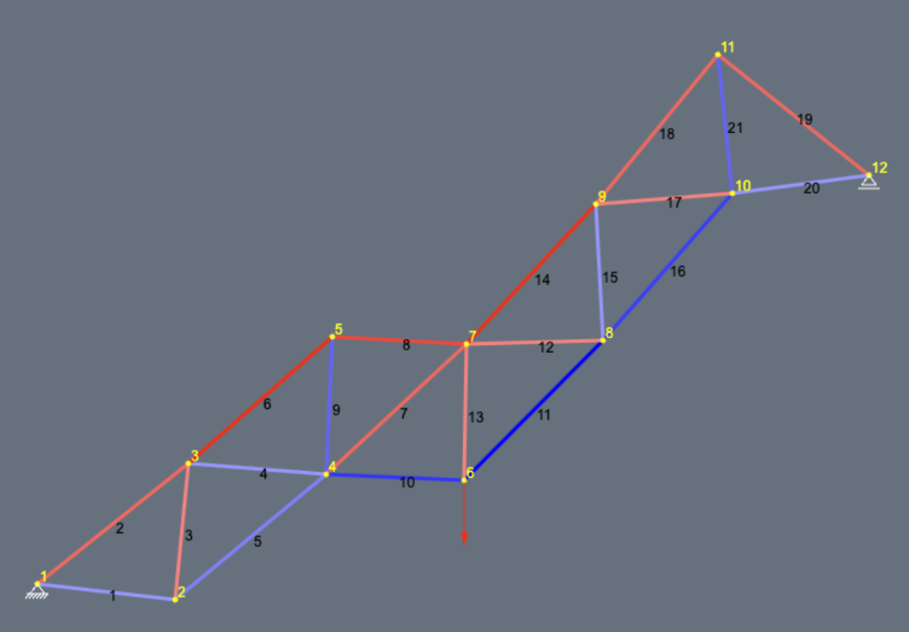

# Truss Design Calculator

The following repository enables engineers to easily calculate the internal force, stress and strain of each member within any 2-D truss design. The code takes in the following inputs:

1. **Nodes**: A single point that represents a joint. 
2. **Members**: A line beam that connects two nodes. 
3. **Supports**: A coorindate of your support. Configure the support to have x and y components. 
4. **Materials**: A material represented by it's cross sectional area and young's modulus. 
5. **Loads**: An external load that is acting on your truss. 

## Example
The code is configured for the following example. Each member is made out of steel. 
